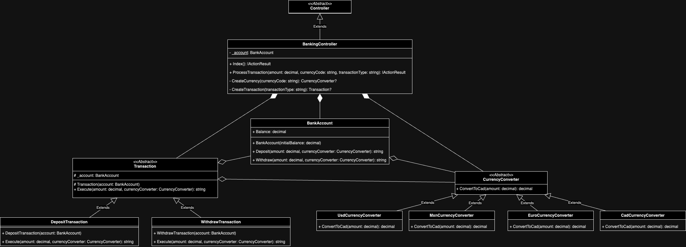

<a id="readme-top"></a>

[![Contributors][contributors-shield]][contributors-url]
[![Forks][forks-shield]][forks-url]
[![Stargazers][stars-shield]][stars-url]
[![Issues][issues-shield]][issues-url]
[![LinkedIn][linkedin-shield]][linkedin-url]

<!-- TABLE OF CONTENTS -->
<details>
    <summary>Table of Contents</summary>
    <ol>
        <li>
            <a href="#about-the-project">About The Project</a>
            <ul>
                <li><a href="#built-with">Built With</a></li>
            </ul>
        </li>
        <li>
            <a href="#getting-started">Getting Started</a>
            <ul>
                <li><a href="#prerequisites">Prerequisites</a></li>
                <li><a href="#installation">Installation</a></li>
            </ul>
        </li>
        <li><a href="#usage">Usage</a></li>
        <li><a href="#contact">Contact</a></li>
        <li>
            <a href="#miscellaneous">Miscellaneous</a>
            <ul>
                <li><a href="#uml-class-diagram">UML Class Diagram</a></li>
                <li><a href="#relevant-files">Relevant Files</a></li>
                <li><a href="#design-choices">Design Choices</a></li>
            </ul>
        </li>
    </ol>
</details>

<!-- About The Project -->
# About The Project
This is a simple banking application developed as part of a take-home assignment for DataCan Services Corp. The application allows users to check their account balance and make deposits or withdrawls in multiple currencies with the applicable exchange rates. This application has the following features:
- Display current account balance (in CAD)
- Make withdrawls and deposits in CAD, USD, MXN, or EURO
- Automatic conversion of foreign currencies to CAD
- Simple web-based user interface

<p align="right">(<a href="#readme-top">back to top</a>)</p>

## Built With

* [![C#][c#-badge]][c#-url]

* [![.NET][.net-badge]][.net-url]

* [![HTML][html-badge]][html-url]

* [![CSS][css-badge]][css-url]

* [![SASS][sass-badge]][sass-url]

* [![vscode][vscode-badge]][vscode-url]

* [![git][git-badge]][git-url]

* [![github][github-badge]][github-url]

<p align="right">(<a href="#readme-top">back to top</a>)</p>

<!-- Getting Started -->
# Getting Started

## Prerequisites
* [![.NET][.net-badge]][.net-url]
* [![git][git-badge]][git-url]
* [![github][github-badge]][github-url]
* [![vscode][vscode-badge]][vscode-url]

<p align="right">(<a href="#readme-top">back to top</a>)</p>

## Installation

### 1. Clone the Repository

First, clone the repository from GitHub to your local machine.

```bash
git clone https://github.com/JohnYu2000/BankingApp.git
cd BankingApp
```

### 2. Install .NET SDK

Ensure that you have the .NET SDK installed on your machine. You can check your .NET SDK installation by running:

```bash
dotnet --version
```

If the command returns a version number, the SDK is installed. If not, download and install the latest .NET SDK.

### 3. Build the Project

Navigate to the project directory and build the project:

```bash
dotnet build
```

### 4. Run the Application

After building the project, you can run the application with the following command:
```bash
dotnet run
```

The application should start, and you can view it in your browser at `http://localhost:8000`.

<p align="right">(<a href="#readme-top">back to top</a>)</p>

<!-- Usage -->
# Usage

Once the application is running, you can:

1. **View your account balance**: The balance is displayed in CAD.
2. **Deposit money**: Enter the amount and select the currency, then click the _Deposit_ button.
3. **Withdraw money**: Enter the amount and select the currency, then click the _Withdraw_ button.

<p align="right">(<a href="#readme-top">back to top</a>)</p>

<!-- Contact -->
# Contact

John Yu - [@LinkedIn](https://www.linkedin.com/in/john-yu-79a345187/) - junye.yu.2@gmail.com

Project Link: [https://github.com/JohnYu2000/BankingApp](https://github.com/JohnYu2000/BankingApp)

<p align="right">(<a href="#readme-top">back to top</a>)</p>

<!-- Miscellaneous -->
# Miscellaneous

## UML Class Diagram


<p align="right">(<a href="#readme-top">back to top</a>)</p>

## Relevant Files

Here is a list of the relevant files in the project along with a brief explanation of their purpose:

- **Models**/
    - **BankAccountModel.cs**: This model represents a bank account. It is responsible for storing the account balance and handling deposit and withdrawal operations. This model is visualized in the `Index` view.
    - **CurrencyConverterModel.cs**: This class is used to convert foreign currencies (USD, MXN, EURO) to CAD using predefined exchange rates.
    - **TransactionModel.cs**: This class represents a financial transaction within the application, such as a withdrawal or deposit. It encapulates the details of each transaction.
- **Controllers**/
    - **BankingController.cs**: This is the main controller for the Banking application. It handles user interactions, such as deposits and withdrawals, and updates the view with the current account balance.
- **Views**/**Banking**/
    - **Index.cshtml**: The main view of the application, this file contains the Razor markup that displays the user interface for the banking application. It shows the account balance, and forms for deposits and withdrawals.
- **wwwroot**/**css**/
    - **site.scss**: This SCSS file contains the styling for the main view of the application, allowing you to customize the look and feel of the UI.

<p align="right">(<a href="#readme-top">back to top</a>)</p>

## Design Choices

**CurrencyConverterClass**

The `CurrencyConverter` class and its derived classes (`UsdCurrencyConverter`, `MxnCurrencyConverter`, `EuroCurrencyConverter`, `CadCurrencyConverter`) were designed with the following principles in mind:
- **Single Responsibility Principle**:
    - Each `CurrencyConverter` class has a single responsibility: converting a specific currency to CAD.
    - This clear separation of concerns ensures that each class is focused and easier to maintain. This allows changes to one currency's conversion logic without impacting others.
- **Open/Closed Principle**:
    - The `CurrencyConverter` class is an abstract base class that defines a contract for converting any currency to Canadian dollars (CAD).
    - This design allows the system to be extended with new currencies without modifying the existing codebase.

**Transaction Class**

The `Transaction` class, along with its derived classes (`DepositTransaction`, `WithdrawTransaction`), adheres to the following OOP and SOLID principles:
- **Single Responsibility**:
    - The `Transaction` class is an abstract base class that represents a financial transaction, such as a deposit or withdrawal.
    - The derived classes each have a single responsibility: to execute a specific type of transaction on a `BankAccount`. This ensures the code remains clean and focused, making it easier to maintain and extend.
- **Liskov Substitution Principle**:
    - The `Transaction` class ensures that any derived class can be substitued for its base class without altering the correctness of the program.
    - This design allows the `BankingController` to execute transactions polymorphically, treating all transactions uniformly, regardless of their specific type.

**BankingController**

The `BankingController` class adheres to the following OOP and SOLID principles:
- **Dependency Inversion Principle**:
    - The `BankingController` class depends on abstractions (`CurrencyConverter` and `Transaction`) rather than concrete implementations.
    - This design choice allows for greater flexibility and testability, as different implementations of `Transaction` and `CurrencyConverter` can be injected or substituted as needed.

<p align="right">(<a href="#readme-top">back to top</a>)</p>

<!-- MARKDOWN LINKS & IMAGES -->
[contributors-shield]: https://img.shields.io/github/contributors/JohnYu2000/BankingApp?style=for-the-badge&color=%2345CC11
[contributors-url]: https://github.com/JohnYu2000/BankingApp/graphs/contributors
[forks-shield]: https://img.shields.io/github/forks/JohnYu2000/BankingApp?style=for-the-badge&color=%23007EC5
[forks-url]: https://github.com/JohnYu2000/BankingApp/forks
[stars-shield]: https://img.shields.io/github/stars/JohnYu2000/BankingApp?style=for-the-badge&color=%23007EC5
[stars-url]: https://github.com/JohnYu2000/BankingApp/stargazers
[issues-shield]: https://img.shields.io/github/issues/JohnYu2000/BankingApp?style=for-the-badge&color=%23DFB316
[issues-url]: https://github.com/JohnYu2000/BankingApp/issues
[linkedin-shield]: https://img.shields.io/badge/LinkedIn-0077B5?style=for-the-badge&logo=linkedin&logoColor=white
[linkedin-url]: https://www.linkedin.com/in/john-yu-79a345187/
[c#-badge]: https://img.shields.io/badge/c%23-%23239120.svg?style=for-the-badge&logo=csharp&logoColor=white
[c#-url]: https://learn.microsoft.com/en-us/dotnet/csharp/
[.net-badge]: https://img.shields.io/badge/.NET-5C2D91?style=for-the-badge&logo=.net&logoColor=white
[.net-url]: https://dotnet.microsoft.com/en-us/download/dotnet/8.0
[html-badge]: https://img.shields.io/badge/html5-%23E34F26.svg?style=for-the-badge&logo=html5&logoColor=white
[html-url]: https://developer.mozilla.org/en-US/docs/Glossary/HTML5
[css-badge]: https://img.shields.io/badge/css3-%231572B6.svg?style=for-the-badge&logo=css3&logoColor=white
[css-url]: https://developer.mozilla.org/en-US/docs/Web/CSS
[sass-badge]: https://img.shields.io/badge/SASS-hotpink.svg?style=for-the-badge&logo=SASS&logoColor=white
[sass-url]: https://sass-lang.com/
[vscode-badge]: https://img.shields.io/badge/Visual%20Studio%20Code-0078d7.svg?style=for-the-badge&logo=visual-studio-code&logoColor=white
[vscode-url]: https://code.visualstudio.com/
[git-badge]: https://img.shields.io/badge/git-%23F05033.svg?style=for-the-badge&logo=git&logoColor=white
[git-url]: https://git-scm.com/
[github-badge]: https://img.shields.io/badge/github-%23121011.svg?style=for-the-badge&logo=github&logoColor=white
[github-url]: https://github.com/